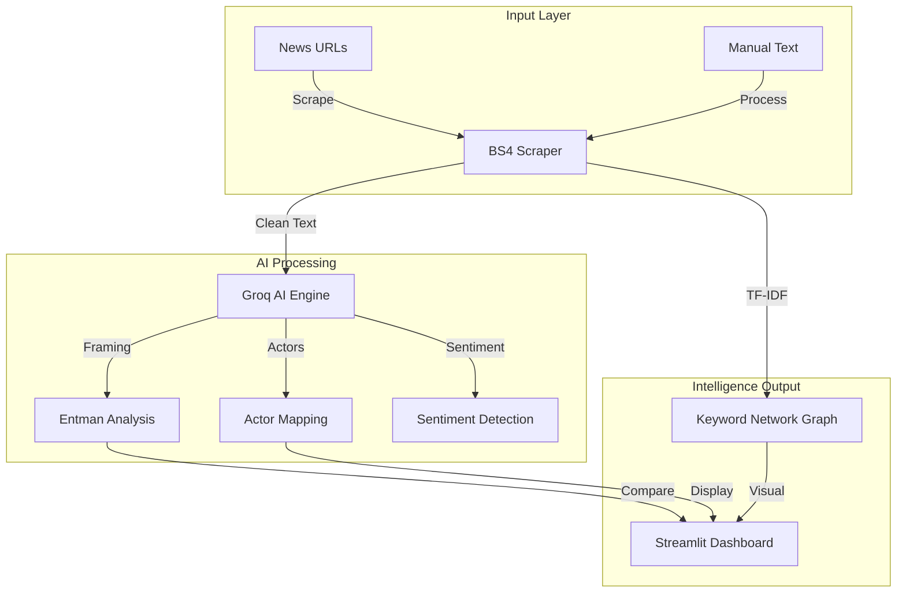

<div align="center">

  # 📰 News Framing Analysis — Automated Media Intelligence
  **Automated Framing Analysis using Robert Entman's Methodology & LLM Intelligence.**
  
  [](https://streamlit.io/)
  [](https://console.groq.com/)
  [](https://llama.meta.com/)
  [](https://www.python.org/)
  [](https://www.nltk.org/)
</div>

---

## Overview

Dalam era banjir informasi, memahami bagaimana media membingkai sebuah isu sangatlah krusial. **News Framing Analysis** adalah platform intelijen media yang mengimplementasikan teori **Robert Entman (1993)** secara otomatis untuk membedah narasi berita online.

Aplikasi ini mentransformasi teks berita statis menjadi data analitik yang mendalam, memungkinkan peneliti dan analis untuk mengidentifikasi definisi masalah, penyebab, penilaian moral, dan solusi yang diimplikasikan oleh berbagai sumber media secara komparatif.

## Technical Features

- **Automated Framing Intelligence**: Mengidentifikasi 4 fungsi framing Robert Entman (Problem Definition, Causal Interpretation, Moral Evaluation, Treatment Recommendation) menggunakan LLM tercanggih.
- **Comparative Analysis Engine**: Menghasilkan laporan perbandingan antar media secara formal untuk melihat perbedaan sudut pandang secara objektif.
- **Actor & Sentiment Mapping**: Mendeteksi aktor utama yang ditonjolkan dan nada sentimen pemberitaan secara otomatis.
- **Keyword Relationship Graph**: Visualisasi interaktif menggunakan **NetworkX** untuk melihat keterkaitan narasi antar media berdasarkan kesamaan kata kunci.
- **Premium Design System**: Antarmuka berbasis Streamlit dengan desain kustom, tipografi modern (Inter), dan navigasi instan yang dioptimalkan.

## Technology Stack

### Intelligence & Backend
- **Core Engine**: Python 3.12+
- **LLM Orchestration**: Groq SDK (Llama 3.3-70B, Llama 3.1-8B, Qwen)
- **NLP Processing**: NLTK (Stopwords removal), Scikit-learn (TF-IDF Vectorization)
- **Web Intelligence**: BeautifulSoup4 (Advanced scraping with garbage filtering)

### Frontend & Visualization
- **Framework**: Streamlit (Custom Premium CSS)
- **Data Visualization**: Matplotlib, NetworkX (Graph Analysis)
- **Language Detection**: Langdetect

## System Architecture



---

## Performance & Methodology

Aplikasi ini dikembangkan dengan fokus pada akurasi metodologis sesuai paradigma Robert Entman.

### Core Metrics & Capabilities
| Parameter | Value | Description |
| :--- | :--- | :--- |
| **Methodology** | **Robert Entman** | 4-Function Framing Analysis |
| **Processing Speed** | **< 5 seconds** | Per article analysis using Groq LPU |
| **Max Capacity** | **3.000 Words** | Optimized for long-form investigative news |
| **Visual Engine** | **NetworkX** | Relationship graph for narrative links |

---

## Deployment Guide

### Prerequisites
*   Python 3.12+
*   Groq Cloud API Key
*   NLTK Corpora (Automated download)

### Execution Procedures

**Step 1: Environment Setup**
```bash
# Clone the repository
git clone https://github.com/flxhrdyn/Gemini-News-Framing-Analysis.git
cd Gemini-News-Framing-Analysis

# Setup project and install all dependencies automatically
uv sync
```

**Step 2: Configuration**
Buat file `.streamlit/secrets.toml` dan tambahkan API Key Anda:
```toml
GROQ_API_KEY = "gsk_..."
```

**Step 3: Run Application**
```bash
uv run streamlit run app.py
```

---

## Configuration

Aplikasi dapat dikonfigurasi melalui sidebar dan file konfigurasi internal:
- `AVAILABLE_MODELS`: Daftar model yang tersedia (Llama 3.3, 3.1, Qwen).
- `MAX_ARTICLE_WORDS`: Batas kata untuk pemrosesan API (Default: `3000`).
- `CUSTOM_STOPWORDS`: Filter kata kunci khusus untuk media Indonesia.

---

## Author

**Felix Hardyan**
*   [GitHub](https://github.com/flxhrdyn)
*   [Hugging Face](https://huggingface.co/felixhrdyn)
