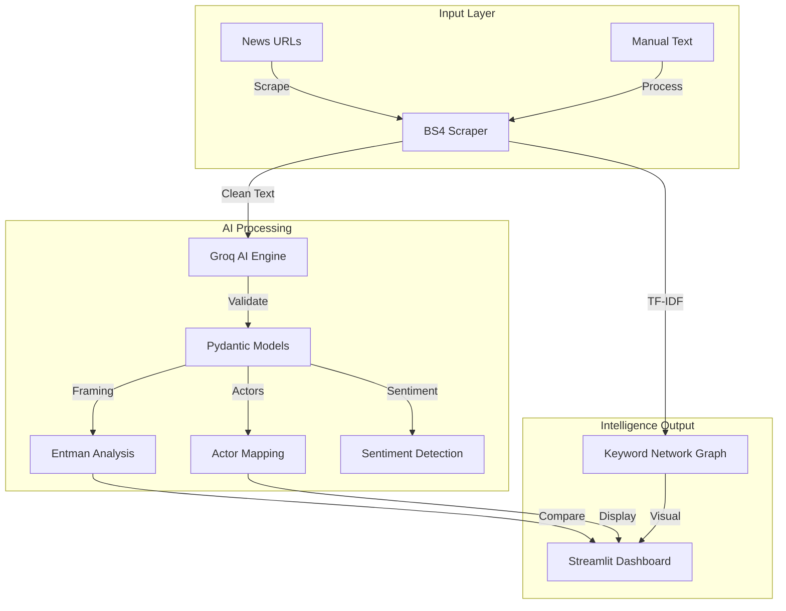

<div align="center">

  # ⚠️ PROJECT ARCHIVED ⚠️
  **This project has been migrated and evolved into [Omnius](https://github.com/flxhrdyn/Omnius).**

  > [!IMPORTANT]
  > I have migrated this project from **Streamlit to React** to provide a more robust and premium experience. 
  > This repository is now archived and will no longer receive updates.

  ---

  # News Framing Analysis — Automated Media Intelligence
  **Automated Framing Analysis using Robert Entman's Methodology & LLM Intelligence.**
  
  [](https://streamlit.io/)
  [](https://console.groq.com/)
  [](https://llama.meta.com/)
  [](https://www.python.org/)
  [](https://www.nltk.org/)
  [](https://opensource.org/licenses/MIT)
</div>

---

## Overview

In the era of information overload, understanding how media outlets frame an issue is crucial. **News Framing Analysis** is a media intelligence platform that implements **Robert Entman's (1993)** framing theory automatically to dissect online news narratives.

The application transforms static news text into deep analytical insights, allowing researchers and analysts to comparatively identify problem definitions, causes, moral evaluations, and implied solutions across various media sources.

## Technical Features

- **Automated Framing Intelligence**: Identifies Robert Entman's 4 framing functions (Problem Definition, Causal Interpretation, Moral Evaluation, Treatment Recommendation) using state-of-the-art LLMs.
- **Comparative Analysis Engine**: Generates formal comparative reports to objectively identify divergent perspectives across media outlets.
- **Actor & Sentiment Mapping**: Automatically detects prominent actors (individuals, groups, or institutions) and the underlying sentiment tone of the coverage.
- **Keyword Relationship Graph**: Interactive visualization using **NetworkX** to reveal narrative links between outlets based on shared keyword significance.
- **Premium Design System**: A Streamlit-based interface featuring a custom design system, modern typography (Inter), and optimized instant navigation.
- **Structured Data Validation**: Implements **Pydantic** to ensure LLM outputs are always consistent, validated, and reliable.

## Technology Stack

### Intelligence & Backend
- **Core Engine**: Python 3.12+
- **LLM Orchestration**: Groq SDK (Llama 3.3-70B, Llama 3.1-8B, Qwen)
- **NLP Processing**: NLTK (Stopwords removal), Scikit-learn (TF-IDF Vectorization)
- **Web Intelligence**: BeautifulSoup4 (Advanced scraping with garbage filtering)
- **Validation**: Pydantic v2

### Frontend & Visualization
- **Framework**: Streamlit (Custom Premium CSS)
- **Data Visualization**: Matplotlib, NetworkX (Graph Analysis)
- **Language Detection**: Langdetect

## System Architecture



---

## Performance & Methodology

This application is developed with a strict focus on methodological accuracy according to Robert Entman's paradigm.

### Core Metrics & Capabilities
| Parameter | Value | Description |
| :--- | :--- | :--- |
| **Methodology** | **Robert Entman** | 4-Function Framing Analysis |
| **Processing Speed** | **< 5 seconds** | Per article analysis using Groq LPU |
| **Max Capacity** | **3,000 Words** | Optimized for long-form investigative news |
| **Data Validation** | **Pydantic** | Zero-failure structured output assurance |
| **Visual Engine** | **NetworkX** | Relationship graph for narrative links |

---

## Deployment Guide

### Prerequisites
*   Python 3.12+
*   Groq Cloud API Key
*   NLTK Corpora (Automated download)

### Execution Procedures

**Step 1: Environment Setup**
```bash
# Clone the repository
git clone https://github.com/flxhrdyn/Gemini-News-Framing-Analysis.git
cd Gemini-News-Framing-Analysis

# Setup project and install all dependencies automatically
uv sync
```

**Step 2: Configuration**
Create a `.streamlit/secrets.toml` file and add your API Key:
```toml
GROQ_API_KEY = "gsk_..."
```

**Step 3: Run Application**
```bash
uv run streamlit run app.py
```

**Step 4: Docker (Optional)**
If you prefer using Docker, you can build and run the containerized version:
```bash
# Build the image
docker build -t news-framing-analysis .

# Run the container
docker run -p 8501:8501 news-framing-analysis
```

---

## Configuration

The application can be configured via the sidebar and internal configuration files:
- `AVAILABLE_MODELS`: List of supported models (Llama 3.3, 3.1, Qwen).
- `MAX_ARTICLE_WORDS`: Word limit for API processing (Default: `3000`).
- `CUSTOM_STOPWORDS`: Keyword filters specifically tuned for Indonesian and Global media.

---

## Author

**Felix Hardyan**
*   [Omnius (New Project)](https://github.com/flxhrdyn/Omnius)
*   [GitHub](https://github.com/flxhrdyn)
*   [Hugging Face](https://huggingface.co/felixhrdyn)

---

## License

This project is licensed under the MIT License - see the [LICENSE](LICENSE) file for details.
